<div align="center">

<!-- HEADER -->


<!-- ANIMATED TYPING -->
<a href="https://git.io/typing-svg">
  
</a>

<!-- SOCIAL BADGES -->
<br/>

<a href="https://wa.me/967780737041">
  
</a>
<a href="https://github.com/YOUR_USERNAME">
  
</a>
<a href="https://www.linkedin.com/in/YOUR_LINKEDIN">
  
</a>
<a href="mailto:your_email@example.com">
  
</a>

<br/><br/>

<!-- PROFILE VIEWS & FOLLOWERS -->


</div>

---

<div align="center">
  
## 🌟 Welcome to My Digital Space! 🌟

</div>

##  About Me


### Hello World! I'm **Moataz Abdullah Altriki ** 👨‍💻

I'm a passionate **first-year student** at **Al-Jazeera University** in Ibb, Yemen 🇾🇪, studying at the **Faculty of Science and Engineering**, Department of **Computer Science**, specializing in **Artificial Intelligence and Data Science**.

<br/>

```yaml
name: Moataz Abdullah Al-Triki
location: Ibb, Yemen 🇾🇪
university: Al-Jazeera University
faculty: Science & Engineering
major: AI & Data Science
year: First Year
passions: [Problem Solving, Reading, Technology, AI]
currently_learning: C++
quote: "Code is poetry written in logic"
```

<br clear="right"/>

---

## 💻 Programming Languages

<div align="center">

<table>
  <tr>
    <td align="center" width="250">
      
      <br/><br/>
      <b style="font-size: 20px;">🐍 Python</b>
      <br/><br/>
      
      <br/><br/>
      <sub>📅 Self-taught before starting my university journey</sub>
      <br/>
      <sub>✨ My first programming language!</sub>
    </td>
    <td align="center" width="250">
      
      <br/><br/>
      <b style="font-size: 20px;">⚡ C++</b>
      <br/><br/>
      
      <br/><br/>
      <sub>🎓 Learning at Al-Jazeera University</sub>
      <br/>
      <sub>📚 Part of my CS curriculum</sub>
    </td>
  </tr>
</table>

</div>

---

## 🎯 My Programming Journey

```mermaid
timeline
    title My Learning Path 🚀
    section Before University
        Self-Learning : 🐍 Started with Python
                      : 📚 Online courses & tutorials
                      : 💡 Built small projects
    section University (2024)
        First Year : 🎓 Joined Al-Jazeera University
                   : ⚡ Learning C++
                   : 🧠 AI & Data Science Major
    section Future Goals
        Coming Soon : 📊 Data Science
                    : 🤖 Machine Learning
                    : 🧠 Deep Learning
```

<div align="center">



</div>

---

## 🛠️ Tools & Technologies

<div align="center">


<br/><br/>

<table>
  <tr>
    <th>Category</th>
    <th>Tools</th>
    <th>Description</th>
  </tr>
  <tr>
    <td>💻 Languages</td>
    <td></td>
    <td>Python (Experienced) • C++ (Learning)</td>
  </tr>
  <tr>
    <td>📝 Editor</td>
    <td></td>
    <td>Visual Studio Code</td>
  </tr>
  <tr>
    <td>🔄 Version Control</td>
    <td></td>
    <td>Git & GitHub</td>
  </tr>
</table>

</div>

---

## 📊 GitHub Statistics

<div align="center">


<br/><br/>


</div>

---

## 📈 Contribution Activity

<div align="center">
  
</div>

---

## 🌟 Interests & Hobbies

<div align="center">

<table>
  <tr>
    <td align="center" width="180">
      
      <br/><br/>
      <b>📚 Reading</b>
      <br/>
      <sub>Exploring new ideas<br/>& expanding knowledge</sub>
    </td>
    <td align="center" width="180">
      
      <br/><br/>
      <b>🔍 Research</b>
      <br/>
      <sub>Always curious<br/>& investigating</sub>
    </td>
    <td align="center" width="180">
      
      <br/><br/>
      <b>🧩 Problem Solving</b>
      <br/>
      <sub>Love tackling<br/>coding challenges</sub>
    </td>
    <td align="center" width="180">
      
      <br/><br/>
      <b>🤖 AI & ML</b>
      <br/>
      <sub>The future<br/>of technology!</sub>
    </td>
  </tr>
</table>

</div>

---

## 🎓 Education

<div align="center">


<br/><br/>

```
╔════════════════════════════════════════════════════════════════════╗
║                                                                    ║
║     🏛️  AL-JAZEERA UNIVERSITY                                      ║
║     ═══════════════════════════                                    ║
║                                                                    ║
║     📍  Location: Ibb, Yemen                                       ║
║     🎓  Faculty: Science and Engineering                           ║
║     💻  Department: Computer Science                               ║
║     🧠  Specialization: Artificial Intelligence & Data Science     ║
║     📅  Academic Year: 2024-2025                                   ║
║     📊  Level: First Year                                          ║
║                                                                    ║
╚════════════════════════════════════════════════════════════════════╝
```

</div>

---

## 🐍 Contribution Snake

<div align="center">
  <picture>
    <source media="(prefers-color-scheme: dark)" srcset="https://raw.githubusercontent.com/YOUR_USERNAME/YOUR_USERNAME/output/github-contribution-grid-snake-dark.svg" />
    <source media="(prefers-color-scheme: light)" srcset="https://raw.githubusercontent.com/YOUR_USERNAME/YOUR_USERNAME/output/github-contribution-grid-snake.svg" />
    
  </picture>
</div>

---

## 🏆 GitHub Trophies

<div align="center">
  
</div>

---

<div align="center">

## 📬 Let's Connect!

<br/>

<a href="https://wa.me/967780737041">
  
</a>
&nbsp;&nbsp;
<a href="https://github.com/YOUR_USERNAME">
  
</a>
&nbsp;&nbsp;
<a href="mailto:your_email@example.com">
  
</a>

<br/><br/>

### 📱 WhatsApp: +967 780 737 041

<br/>

---

<br/>

### 💭 Random Dev Quote


<br/><br/>

---

<br/>


<br/>

> **"The journey of a thousand miles begins with a single step."** 🚀
>
> *Every line of code is a step forward!*

<br/>

---

<sub>⭐️ Designed with ❤️ by <a href="https://github.com/YOUR_USERNAME"> Moataz-Altriki </a> | Yemen 🇾🇪</sub>

<br/>


</div>
